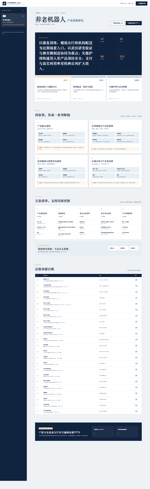

# 产业投资研究 Agent

一个面向政府产业平台、国有资本、产业集团、园区和市场化基金的 **AI 产业研究工作台**。

用户输入 **产业 + 区域 + 实施主体** 后，Agent 会围绕产业链、应用场景、技术路线、区域布局、重点企业与项目开展公开检索和证据核验，并最终形成两项核心研究成果：

> **成果一：可编辑的“四图五清单”产业研究 PPT**
> **成果二：可追溯、可更新的产业研究增强基础数据库**

网页负责研究任务创建、Agent 执行过程展示和研究结果预览，是整个研究流程的交互入口；**PPT 与数据库才是最终交付成果**。

> 项目内置“湖北省 · 养老机器人”完整示范案例。示范案例中的评分用于尽调排序和项目验证，不构成投资建议。

---

## 项目效果展示

下面为项目实际网页的完整呈现效果。即使不下载代码、不配置模型 API，也可以先通过该页面了解系统最终的交互形态和研究结果组织方式。

<p align="center">
  
</p>

网页主要承担三类功能：

- **研究任务管理**：创建不同产业、区域和实施主体的研究任务，并保存历史任务；
- **Agent 过程展示**：显示研究状态、检索与核验进度，并支持失败恢复和局部更新；
- **结果可视化预览**：集中呈现决策摘要、四图、五清单、来源台账，并提供 PPT 与数据库下载入口。


---

# 两项核心成果

## 成果一：养老机器人“四图五清单”产业研究 PPT

**文件：** `养老机器人四图五清单_20260731.pptx`

[**点击下载 25 页可编辑 PPT →**](public/downloads/养老机器人四图五清单_20260731.pptx)

PPT 面向管理层汇报和投资决策讨论，将数据库中的事实、证据和结构化分析进一步组织为完整的产业研究结论。

核心内容包括：

### 四图分析

| 图谱                 | 核心问题                                             |
| -------------------- | ---------------------------------------------------- |
| **产业链图**   | 产业由哪些环节组成？价值、能力和风险集中在哪里？     |
| **应用领域图** | 产品解决谁的什么问题？谁使用、谁采购、谁付费？       |
| **技术路线图** | 哪些技术已经成熟？哪些仍需要验证？投资窗口在哪里？   |
| **区域分布图** | 全国资源在哪里？武汉和湖北应该在哪里承接、如何协同？ |

### 五清单分析

| 清单                   | 作用                                           |
| ---------------------- | ---------------------------------------------- |
| **产业集群清单** | 识别重点区域、产业基础和协同方向               |
| **政策清单**     | 梳理国家、湖北及武汉相关政策与支持工具         |
| **重点企业清单** | 建立企业池并形成尽调优先级                     |
| **重点项目清单** | 形成可落地、可跟踪的项目机会池                 |
| **产业问题清单** | 明确产业落地过程中的技术、商业、合规和运营风险 |

PPT 不是简单把 Excel 表格复制到页面，而是按照管理层的决策顺序形成：

```text
产业认知
   ↓
四图形成判断
   ↓
五清单形成行动对象
   ↓
企业 / 项目筛选
   ↓
场景经济性验证
   ↓
投资布局与行动建议
```

最终形成一套可直接用于 **产业汇报、项目讨论、企业筛选和后续尽调** 的可编辑研究报告。

---

## 成果二：养老机器人产业增强基础数据库

**文件：** `养老机器人产业基础数据库.xlsx`

[**点击下载 Excel 研究数据库 →**](public/downloads/养老机器人产业基础数据库.xlsx)

数据库是整个项目的研究底座，不是简单的企业名单，而是一套围绕 **事实—证据—分析—决策** 构建的结构化产业研究数据库。

当前示范数据库共包含 **17 张专业底表**：

| 模块                     | 数据表               | 主要内容                                                   |
| ------------------------ | -------------------- | ---------------------------------------------------------- |
| **研究说明**       | 使用说明             | 研究范围、数据口径、增强规则与使用边界                     |
| **产业认知**       | 产业链环节           | 上中下游环节、产业角色、价值判断与武汉切入点               |
|                          | 重点产品             | 产品类别、应用场景、成熟度、商业模式与代表企业             |
|                          | 市场规模及盈利能力   | 市场指标、增长趋势、盈利能力和数据口径                     |
|                          | 核心技术             | 技术成熟度、关键瓶颈、主流时间和投资优先级                 |
| **区域与政策**     | 区域及产业集群       | 全国重点集群、湖北协同区域和武汉布局方向                   |
|                          | 政策清单             | 国家、省、市政策及对应产业机会                             |
| **投资对象**       | 重点企业             | 企业画像、产品、商业进展、资本阶段、建议合作方式和尽调事项 |
|                          | 重点项目及融资事件   | 项目机会、融资事件、建设进展和下一步动作                   |
|                          | 产业问题             | 技术、市场、支付、合规、平台和运营问题                     |
| **主体匹配**       | 武汉城投公开资源     | 主体公开资源、可协同资源与产业匹配关系                     |
| **量化分析**       | 企业及项目综合评分   | 对重点企业和项目形成结构化筛选与尽调优先级                 |
|                          | 场景 ROI 测算        | 保守 / 基准 / 乐观三情景经济性测算                         |
| **证据与质量控制** | 数据来源索引         | 来源 ID、发布主体、链接、可信度与核验状态                  |
|                          | 更新变更日志         | 数据库不同版本的更新记录                                   |
|                          | 数据缺口及待核实事项 | 未公开信息、关键假设以及后续尽调任务                       |
|                          | 检索过程及饱和度记录 | 记录检索范围、过程和数据覆盖程度                           |

数据库重点解决传统产业研究中的三个问题：

1. **报告结论无法追溯**：关键事实绑定来源 ID，可以回到底层证据；
2. **研究成果难以更新**：企业、政策、项目等模块可以继续增量补充，而不是每次重新写报告；
3. **事实与判断混在一起**：公开事实、企业披露、研究判断、情景假设和待核事项分开记录。

因此，Excel 数据库既是 PPT 的数据底座，也是后续 **产业跟踪、企业尽调、项目更新和专题研究** 的持续工作底稿。

---

## 网页、PPT 与数据库之间的关系

这个项目不是单纯做一个网页，也不是让大模型直接生成一份报告，而是把产业研究形成一条完整链路：

```text
用户输入研究任务
产业 + 区域 + 实施主体
        ↓
Agent 读取内部材料并开展公开检索
        ↓
事实抽取 + 来源核验 + 数据结构化
        ↓
产业研究增强基础数据库
        ↓
四图 + 五清单 + 评分 + ROI + 主体资源匹配
        ↓
可编辑产业研究 PPT
        ↓
网页统一展示研究过程和结果，并提供成果下载
```

其中：

- **网页**：研究交互与结果展示载体；
- **数据库**：底层研究事实和证据资产；
- **PPT**：面向汇报和决策的研究成果。

---

## Agent 如何完成一次产业研究

一次完整研究按照六个阶段推进：

```text
01 定义边界
     ↓
02 读取材料
     ↓
03 公开检索
     ↓
04 证据核验
     ↓
05 四图五清单
     ↓
06 生成成果
```

研究过程中，Agent 会围绕产业链、产品、市场、技术、区域、政策、企业和项目等不同主题进行结构化检索，并将来源统一编入证据台账。

系统还支持：

- 上传内部研究材料；
- 实时显示研究进度；
- 保存研究检查点；
- 失败后从已有草稿恢复；
- 单独更新企业、政策或项目模块；
- 自动重新生成 Excel 与 PPTX。

---

## 湖北省养老机器人示范案例

项目首页内置 **“湖北省 · 养老机器人”** 固定示范任务，用于直接展示项目希望达到的研究密度和成果质量。

网页中可以看到：

- 决策摘要与投资判断；
- 四张产业图谱；
- 五张管理清单；
- 来源证据台账；
- 企业 / 项目筛选结果；
- 数据库与 PPT 下载入口。

示范研究形成的核心思路是：围绕康复、机构运营、护理、辅助出行等养老机器人场景，从 **产业结构、应用价值、技术成熟度和区域承接能力** 四个维度形成判断，再落到具体企业、项目和行动清单。

---

## 主要功能

- 创建任意产业、任意区域的产业研究任务；
- 输入不同实施主体，形成主体资源匹配分析；
- 支持通义千问 / OpenAI；
- 上传内部材料并与公开检索结合；
- 实时展示 Agent 检索、核验和结构化进度；
- 自动建立来源编号与证据台账；
- 自动形成四图五清单；
- 生成结构化 Excel 研究数据库；
- 生成可编辑 PowerPoint；
- 支持企业、政策、项目模块局部更新；
- 支持检查点恢复，减少长任务失败后的重复研究。

---

## 本地运行

> 本地运行用于创建新的研究任务，**不是查看示范成果的前置条件**。

环境要求：

- Node.js 22.13 或更高版本
- npm

安装依赖：

```bash
npm install
```

复制环境变量模板：

```bash
cp .env.example .env.local
```

### 通义千问 Token Plan

```env
DASHSCOPE_API_KEY=sk-sp-你的TokenPlan密钥
DASHSCOPE_BASE_URL=https://token-plan.cn-beijing.maas.aliyuncs.com/compatible-mode/v1
QWEN_MODEL=qwen3.8-max
QWEN_MAX_OUTPUT_TOKENS=100000
RESEARCH_TOTAL_TIMEOUT_MINUTES=60
RESEARCH_INACTIVITY_TIMEOUT_MINUTES=5
```

### 百炼按量付费

```env
DASHSCOPE_API_KEY=sk-你的普通百炼APIKey
DASHSCOPE_BASE_URL=https://dashscope.aliyuncs.com/compatible-mode/v1
QWEN_MODEL=qwen3.8-max
QWEN_MAX_OUTPUT_TOKENS=100000
```

### OpenAI（可选）

```env
OPENAI_API_KEY=你的OpenAI_API_KEY
OPENAI_MODEL=你的模型名称
```

启动项目：

```bash
npm run dev
```

浏览器打开：

```text
http://localhost:3000
```

构建检查：

```bash
npm run build
```

---

## 如何创建新的产业研究任务

1. 点击网页右上角 **“创建研究任务”**；
2. 输入目标产业、核心区域、实施主体和研究重点；
3. 选择通义千问或 OpenAI；
4. 按需上传内部材料；
5. 启动 Agent 研究；
6. 等待完成公开检索、证据核验和结构化分析；
7. 在网页查看四图、五清单和来源台账；
8. 下载最终 **PPT + Excel 数据库**。

如果长任务因为网络或模型输出限制中断，可以优先使用检查点恢复功能，而不是从头重新检索。

---

## 项目结构

```text
app/
  page.tsx                  # 研究工作台与结果展示
  api/research/route.ts     # Agent 调用、流式进度、检查点与自动续写

lib/
  research-schema.ts        # 研究数据库结构与验收要求
  research-types.ts         # 研究任务与结果类型
  office.ts                 # Excel / PowerPoint 生成
  sample-eldercare-robot.ts # 养老机器人示范数据

public/
  downloads/
    养老机器人产业基础数据库.xlsx
    养老机器人四图五清单_20260731.pptx

docs/
  images/
    webpage-overview.png    # README 网页效果展示图
```

---

## 数据与安全

- API Key 只由服务端读取，不写入前端页面；
- `.env.local` 不应提交到 GitHub；
- 用户上传的内部材料只用于当前研究任务；
- 公开来源与内部材料在证据体系中分开标记；
- 无法公开核验的数据明确进入“数据缺口及待核实事项”；
- 自动评分只用于企业 / 项目筛选和尽调排序，不代表最终投资结论。

---

## 技术栈

`Next.js` · `React` · `TypeScript` · `Vite / vinext` · `Cloudflare Workers` · `通义千问 Responses API` · `OpenAI Responses API`

---

## License
当前项目未附加开源许可证。未经项目所有者明确授权，请勿将示范数据库、PPT 或研究成果用于商业再分发。
